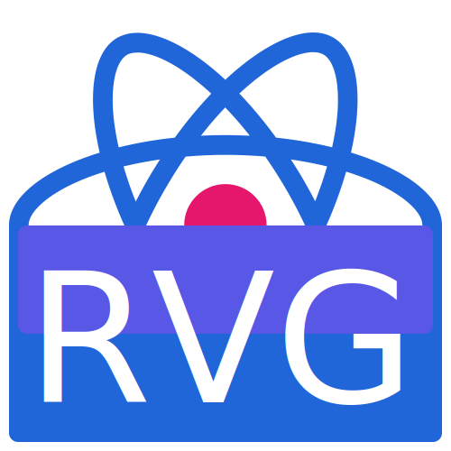

# react-vector-graphics

<span></span>

[](https://github.com/tophat/react-vector-graphics/actions/workflows/pull-request.yml)
[](https://renovatebot.com/)
[](https://discord.gg/YhK3GFcZrk)
[](https://opensource.org/licenses/Apache-2.0)

<!-- ALL-CONTRIBUTORS-BADGE:START - Do not remove or modify this section -->
[](#contributors-)
<!-- ALL-CONTRIBUTORS-BADGE:END -->

## Overview

Automate the building of `React` components from svg files.

## Motivation

Started off as a project to stop svg files from being scattered over multiple repos. It turned into a way to auto generate the react components directly to reduce boilerplate. Then have the auto generation support multiple configuration per repository. Finally creating a bot to handle the generation and optimisation of the svgs.

## Usage

See individual package readmes for more detailed documentation.

| Documentation                                                                | Version                                                                                                                                                     |
| ---------------------------------------------------------------------------- | ----------------------------------------------------------------------------------------------------------------------------------------------------------- |
| [`@react-vector-graphics/core`](./packages/core/README.md)                   | [](https://www.npmjs.com/package/@react-vector-graphics/core)                   |
| [`@react-vector-graphics/cli`](./packages/cli/README.md)                     | [](https://www.npmjs.com/package/@react-vector-graphics/cli)                     |
| [`@react-vector-graphics/plugin-assets`](./packages/plugin-assets/README.md) | [](https://www.npmjs.com/package/@react-vector-graphics/plugin-assets) |
| [`@react-vector-graphics/plugin-github`](./packages/plugin-github/README.md) | [](https://www.npmjs.com/package/@react-vector-graphics/plugin-github) |

## Contributing

Install dependencies

```sh
yarn install
```

Run all tests

```sh
yarn test --watch
```

Build all packages

```sh
yarn build
```

## Contributors

<!-- ALL-CONTRIBUTORS-LIST:START - Do not remove or modify this section -->
<!-- prettier-ignore-start -->
<!-- markdownlint-disable -->
<table>
  <tr>
    <td align="center"><a href="http://emmanuel.ogbizi.com"><br /><sub><b>Emmanuel Ogbizi</b></sub></a><br /><a href="https://github.com/tophat/react-vector-graphics/commits?author=iamogbz" title="Code">💻</a> <a href="#ideas-iamogbz" title="Ideas, Planning, & Feedback">🤔</a> <a href="#infra-iamogbz" title="Infrastructure (Hosting, Build-Tools, etc)">🚇</a> <a href="#maintenance-iamogbz" title="Maintenance">🚧</a> <a href="https://github.com/tophat/react-vector-graphics/commits?author=iamogbz" title="Tests">⚠️</a> <a href="#design-iamogbz" title="Design">🎨</a> <a href="https://github.com/tophat/react-vector-graphics/commits?author=iamogbz" title="Documentation">📖</a></td>
    <td align="center"><a href="https://github.com/umar-ahmed"><br /><sub><b>Umar Ahmed</b></sub></a><br /><a href="https://github.com/tophat/react-vector-graphics/commits?author=umar-ahmed" title="Code">💻</a> <a href="#ideas-umar-ahmed" title="Ideas, Planning, & Feedback">🤔</a></td>
  </tr>
</table>

<!-- markdownlint-enable -->
<!-- prettier-ignore-end -->

<!-- ALL-CONTRIBUTORS-LIST:END -->

```txt
@all-contributors please add <username> for <contribution type>
```
